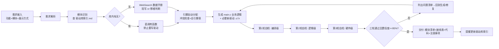

# STM32F103C8T6 接单开发智能体 · 设计方案

> 目标：接到一个新单片机设计需求后，智能体自动完成「需求解析 → 模块识别 → 引脚分配 → 业务代码(main.c) → 三轮自检 → 交付」，准确率目标是让 95% 以上的交付可直接编译烧录。

## 1. 总体架构



### 1.1 单 Agent 与多 Agent 两种形态

| 形态 | 适用 | 优点 | 缺点 |
|---|---|---|---|
| 单 Agent 串行（推荐起步） | 大多数常规单子 | 简单、上下文连贯、成本低 | 自检容易「自我背书」，需要强检查表约束 |
| 多 Agent 协作（进阶） | 复杂多模块项目 | 规划者/编码者/审查者角色分离，审查独立性强 | 上下文割裂、成本高、需要结构化中间产物 |

> 建议：先用单 Agent + 强制检查表；遇到摄像头、文件系统等大移植任务时，才用「1 规划 + 1 编码 + 3 独立审查」的多 Agent 编排（在本机 DSH 环境可用 workflow 工具实现）。

## 2. 知识底座：让「识别准确」成为必然

识别准确不能靠模型记忆力，要靠**可检索的权威数据**。三件套：

| 资产 | 内容 | 用途 | 维护方式 |
|---|---|---|---|
| 驱动库索引.md | 全部驱动：模块名/通信/默认引脚/库文件/初始化/API | 判断「库内 or 库外」的唯一依据 | gen-index.js 自动生成，增删驱动后重跑 |
| 各驱动 .h 头文件 | 完整函数签名与引脚宏 | 调用时核对参数、不写错函数名 | 库本体，只读 |
| 工程模板 (E:/工作模版/project) | main.c 骨架、USER CODE 区域、CubeMX 外设配置 | 业务代码落地的唯一目标结构 | 用户维护 |

### 2.1 已交付：索引自动生成器

本目录下已生成 `gen-index.js` 与 `驱动库索引.md`（v3，主索引 62 项 + 例程独有 16 项 + 多版本 11 组 + 默认引脚冲突统计）。

```bash
node gen-index.js   # 驱动库增删后重跑，索引自动刷新
```

### 2.2 你的库里发现的 7 个「坑」（智能体必须知道的规则）

1. **文件编码是 GBK/GB2312**：所有 .c/.h 注释是 GBK。新建文件要么用 GBK 写注释，要么注释全用英文；不要把 UTF-8 中文直接粘进 Keil（乱码）。
2. **同名多版本**：DHT11 有 4 个版本（库内 PB13 / 模板 PB15 / HalCode PA0 / 温湿度-多个 PB3+PB13）、OLED 有 2 套 API（Oled_ShowString vs OLED_ShowString 带字号参数）、INA219 有 2 套（PB5/6 vs PB14/15）。**调用前必须按 .h 签名消歧，优先选「模板 Hardware」版本**。
3. **默认引脚大面积撞车**：PB5/PB6 被 SGP30/TCS34725/MPU6050/BH1750/INA219/HC-SR04 等共享；PB12~PB15 被 DS18B20/BMP180/DS1302/DHT11/AT24C02/MAX30102/MLX90614/HX711/STEPPER 等共享。**多模块项目禁止直接按库内默认引脚接线，必须走引脚分配算法**。
4. **模板与库的引脚不一致**：模板 OLED=PB0/PB1 软 I2C（你提示词里写的 PB8/PB9 硬件 I2C 与模板不符，需确认以哪个为准）；模板 DHT11=PB15（不是 PA1）；模板 DS18B20=PB11、DS1302=PB4/5/6。
5. **模板 MOTOR 是空壳**：motor.h 里 MOTOR_BUJIN/MOTOR_ZHILIU/MOTOR_DUOJI 三个开关全为 0；舵机 SG90 需要 TIM PWM（模板未配 TIM2），真正可用的电机驱动在例程「步进电机+直流电机+舵机/实物程序/project/Hardware/MOTOR」里，属移植参考。
6. **库内缺智能农业核心模块**：土壤温湿度/EC/PH/氮磷钾 在库内没有独立驱动（例程「土壤环境」里也只有 DELAY/KEY/OLED，传感逻辑写在 main.c），接农业单时需现写或移植。
7. **GPS/AS608 只有例程源码**：采用 Inc/Src 拆分结构，且依赖各自工程的延时/引脚宏，属于「建议移植」而非直调。RC522 也有 3 套（位带软 SPI / HAL SPI2 / 51 代码 MFRC522），需按平台选择。

## 3. 模块识别算法（伪代码）

```
识别(需求文本):
  1. 提取实体清单: 型号(如 RC522/SGP30)、中文名(如 刷卡/甲醛)、功能词(如 温湿度)
  2. 对每个实体查 驱动库索引.md: 型号精确匹配 > 中文别名匹配 > 功能关键词匹配
  3. 命中多个版本时: 按 模板版本 > API 与模板 main.c 兼容(位带 PBout 风格) > 引脚不冲突 排序
  4. 命中 0 个 -> 标记为陌生模块，进入 WebSearch 流程
  5. 输出: 模块清单(库内直调/现写/移植) + 各自 .h 的准确 API 签名
```

匹配关键词建议维护在索引里（模块别名列）：如 RC522=MFRC522=RFID=刷卡；PM25=粉尘=GP2Y1010；DHT11=温湿度；DS18B20=温度；BUZZER=蜂鸣器。

## 4. 引脚自动分配算法（核心）

### 4.1 F103C8T6 引脚资源池（LQFP48）

| 分组 | 引脚 | 规则 |
|---|---|---|
| 硬性保留 | PA13/PA14 (SWD)、PA9/PA10 (USART1 调试)、PA2/PA3 (USART2 通信) | 永不释放 |
| 可选保留 | PC13 (LED)、PC14/15 (LSE 晶振) | 默认保留 |
| 可用 | PA0/PA1/PA4~PA8/PA11/PA12/PA15、PB0~PB15、PC13~PC15 | 分配池 |
| 不存在 | PC0~PC12、PD/PE/PF/PG | C8T6 没有，严禁使用 |

### 4.2 分配顺序（贪心 + 冲突消解）

```
1. 收集需求: 每个模块需要 (总线类型, 引脚数, 是否可共用)
2. 先分专用资源: 每个 UART 独占一对引脚; ADC 通道; TIM PWM 通道; EXTI 中断引脚
3. 再分软总线: 软 I2C 优先合并到同一对引脚(地址不同可共用); 单总线每路 1 根;
4. 剩下 GPIO: 按键/继电器/LED/蜂鸣器 随便放, 避开 1~3 已占用
5. 校验: 引脚无冲突 && 供电/电平匹配 && 7bit I2C 地址不重复 && 定时器通道不超限
6. 输出: 总引脚分配表(模块 | 信号 | 引脚 | 复用功能 | 电平要求)
```

### 4.3 常见冲突与解法速查

| 冲突 | 解法 |
|---|---|
| 两个软 I2C 模块默认都在 PB5/PB6 | 合并到同一总线（地址不同）；地址相同才拆第二路 |
| 单总线模块都占 PB13 | 每个单总线模块独立一根 GPIO，换 PB3/PB4/PA15 等空闲脚 |
| 串口不够（USART2 被 ESP8266 占，GPS 还要串口） | 软串口(IO 模拟 9600) 或换 USART3(注意 PB10/PB11 复用) 或模块改用别的总线 |
| TIM 通道冲突（舵机+电机都要 PWM） | 舵机用 TIM2_CH1..CH4，电机用 TIM3/TIM4，或改用普通 GPIO 慢速控制 |
| ADC 通道不够 | PM25/光敏/MQ2 模拟量都要 ADC，可轮流采样（分时） |

## 5. 业务代码生成规范（main.c）

- **结构跟随模板**：只在 USER CODE 区域内改；沿用模板的模块化函数：Key_Function / Monitor_Function / Display_Function / Manage_Function / 数据上报函数；沿用 10ms 分时调度（flag_time_10ms / time_num）。
- **直调规则**：库内模块只写调用，不复制驱动代码；头文件用相对路径包含（./OLED/oled.h）。
- **单位与类型**：沿用模板约定（DHT11 返回 uint16_t 的 10 倍值，显示时 /10；ADC 值 0~4095 12bit）。
- **资源意识**：64KB Flash / 20KB RAM；大数组放全局或 const；避免大栈数组（模板 send_data[512] 是全局）；字符串字面量用 GBK 转义或直接中文（注意编码）。
- **中断**：USART1/2 接收用 HAL_UART_Receive_IT + HAL_UART_RxCpltCallback（模板已有），新模块如需中断按同样风格扩展。

## 6. 三轮自检与 95% 置信度协议

「自检三遍」不是把代码读三遍，而是**三个不同角度的检查**，每轮输出问题清单与修复：

| 轮次 | 角度 | 检查内容（节选） | 一票否决项 |
|---|---|---|---|
| 第1轮 | 编译级 | 头文件包含/路径、函数签名与 .h 一致、宏与类型、括号分号、重复定义、变量未声明、uint8_t 等类型存在 | 任何编译错误 |
| 第2轮 | 逻辑级 | 初始化顺序、while(1) 调度不阻塞、超时标志、按键消抖、边界值/除零、单位换算、阈值比较方向、溢出、数组越界 | 死循环阻塞 / 数组越界 / 比较逻辑反 |
| 第3轮 | 硬件级 | 引脚冲突、总线复用、上拉/电平、供电、时序参数 vs 数据手册、I2C 地址、PWM 频率占空比范围 | 引脚冲突 / 电平不匹配 |

### 6.1 置信度评分法

- 满分 100，按检查表逐项扣分（每项 2~5 分）；
- **< 80 分：禁止交付**，修复后重新三轮；
- **80~94 分：可交付但必须标注「已知风险项」**；
- **≥ 95 分：正常交付**；
- 任何「一票否决项」直接判 0 分回到生成阶段，不允许带着已知编译错误交付；
- 自检记录必须随交付附上（三轮各发现什么问题、改了什么），这是客户信任的来源。

## 6.5 机器化验证（已落地，第一轮自检的机器执行）
- verify-project.js v3.1：引脚冲突/非法引脚(F103C8T6 引脚白名单)/保留引脚/软I2C共总线识别、API 签名与参数个数匹配（调用点 ↔ .h 原型）、include 图可达性（只统计 main.c 实际引用的模块）、#if 宏开关求值、括号平衡（含字符字面量）、GBK 编码、USART1 波特率与分号、OLED 一致性；退出码 0=通过 1=失败 2=通过但有 minor。
- compile-check.sh：arm-none-eabi-gcc -fsyntax-only 逐文件语法检查（真实编译器，需工具链）。
- compile-check-keil.js：本机 Keil armcc（D:/Keil_v5/ARM/ARMCC）真实编译验证——自动解析 project.uvprojx 的 FilePath/IncludePath/Define，逐 .c 编译，0 Error 才通过。已实测：智能辅助驾驶系统 33 个文件 0 Error。
- 实测记录（示例订单 温湿度光照监测器）：机器验证抓到 2 个 critical（BH1750 与未用 DS1302 的 PB5/6 冲突 → 改为可达性统计后消除误报；usart.c 波特率行缺分号 → 修复并给验证器加缺分号检查）；三路审查另抓到 uvprojx 未收录新驱动、云模块残留、接线表缺 VCC/GND、旧构建产物 4 个 major，全部修复后最终 PASS（0/0/0）。
- 教训固化：任何改动 usart.c 波特率/编码的操作必须二进制安全；新增驱动必须同步 uvprojx；清理旧构建产物。
## 7. 陌生模块：现写 vs 移植决策矩阵

| 条件 | 建议 | 例子 |
|---|---|---|
| 简单 IO/总线外设，资料齐全，数据手册可查 | 现写 | DHT11、BH1750、继电器、按键 |
| 中等协议（I2C/SPI/UART 寄存器多） | 现写（查 datasheet 的寄存器表） | RC522、SGP30、MLX90614 |
| 协议栈/文件系统/图像/复杂算法 | 建议移植 | FatFs、LwIP、OV7670、VS1053、USB |
| 库里已有例程源码（GPS/AS608/MOTOR 等） | 移植例程并按 6 步模板改造 | GPS NEO-6M、AS608、电机驱动 |

移植六步模板（固定输出）：
```
① 获取源码来源  ② 文件清单与放置目录  ③ HAL 抽象层对接(改写底层读写函数)
④ 引脚宏与延时适配(换成本工程 delay/SysTick)  ⑤ 头文件与编译(include 路径/报错处理)  ⑥ 最小验证例程+预期现象
```

## 8. 交付物模板（每次必须包含）

1. **模块清单**：模块 | [库内直调/现写驱动/建议移植] | 所用库文件 | 初始化函数 | 关键 API；
2. **接线表**：模块引脚 ↔ STM32 引脚（含 5V/3.3V 电平标注）；
3. **总引脚分配表**：全部模块一张表，标注冲突检查结果；
4. **代码**：分文件（main.c 业务 + 新增驱动 .c/.h），带注释，注明编码 GBK；
5. **三轮自检记录**：每轮发现/修复/残留风险 + 最终置信度；
6. **注意事项**：供电、电平、上拉、时序坑点。

## 9. 维护闭环

- 每次交付新驱动后，智能体主动提示：「已写 xx.c/h，请放入驱动库并运行 node gen-index.js 更新索引」；
- 用户把新模块文件夹放入 E:/单片机模块驱动 后重跑索引，下次同类单子自动变成「库内直调」；
- 定期把「例程独有驱动」（GPS/AS608/MOTOR 等）整理成独立文件夹，从参考升级为库内。

## 10. 本机落地建议（DSH 环境）

1. **立即可用**：把「接单助手-系统提示词.md」贴进任意支持 WebSearch 的 AI（本机 DSH 会话、豆包、Kimi 等）；
2. **进阶（推荐）**：在本机 DSH 中注册为预设（preset）：系统提示词 = 本提示词 + 知识库文件路径 + 工具规则（bash 读文件需 iconv GBK 转码、node 跑 gen-index.js、WebSearch 查手册）；
3. **多 Agent 化**：用 DSH workflow 编排「规划者 → 编码者 → 3 个独立审查者（编译/逻辑/硬件）」五子任务，审查结果结构化评分，达到 95% 才输出交付包；
4. **验证闭环**：可在本机装 arm-none-eabi-gcc + Keil 命令行或 cmake 编译工程做第 1 轮自检的机器校验（真编译比肉眼检查可靠得多）。

## 附：与提示词原稿的矛盾点（需你确认）

| 原稿说法 | 模板实际情况 | 建议 |
|---|---|---|
| OLED I2C PB8/PB9 硬件 I2C | 模板 OLED 是 PB0/PB1 软件 I2C | 以模板为准，提示词改为「OLED 固定用模板 OLED 模块（PB0/PB1 软 I2C）」 |
| DHT11 单总线 PA1 | 模板 DHT11 = PB15 | 以模板为准 |
| 舵机 SG90 TIM2 CH1 | 模板无 TIM2 舵机配置，MOTOR 空壳 | 确认舵机需求时按例程 MOTOR 移植或新配 TIM |
| 显示 0.96 寸 OLED SSD1306 分辨率 128x64 | 一致 | 无需改 |
| USART1 波特率 | 模板 usart.c 原为 9600 | 按你的要求已改为 115200（模板与验证器同步更新） |
